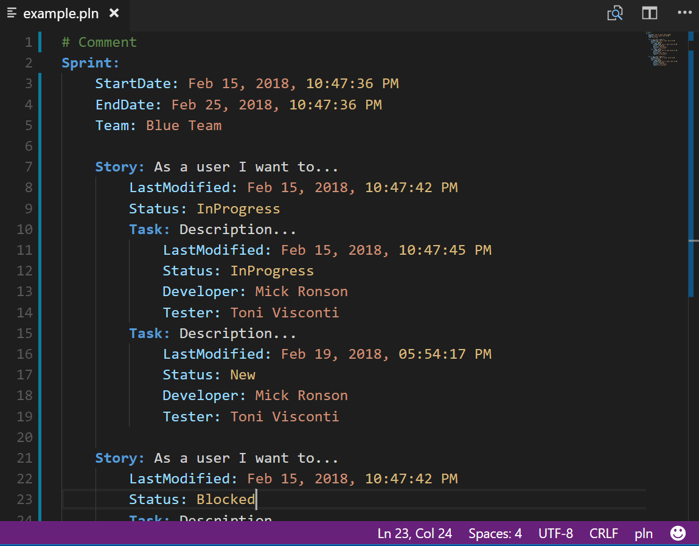

# Visual Studio Code Extension - Planning Syntax Language

## Overview

A Visual Studio Code extension to support color coding `.pln` text file to organize Epic, Backlog, Sprint, Story, Tasks.

## Snippet Code

* Keyword:
    * Epic
    * Backlog
    * Sprint
    * Story
    * Task
* List
    * team
    * developer
    * now
    * date

## License and Copyright

* MIT license
* (C) Frederic Torres 2018
